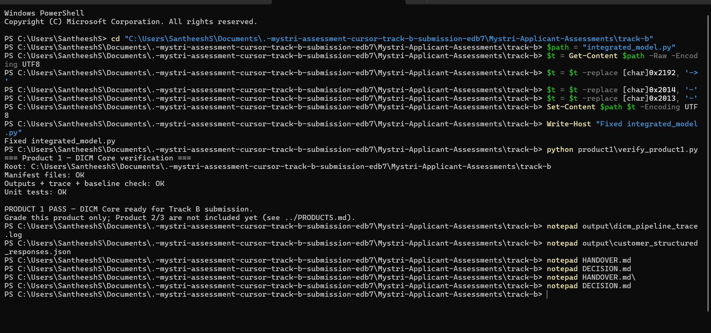

# Daybreak Track B — Product 1 (DICM Core)

**Daybreak Integrated Collaborating Model (DICM)** — Mystri Track B assessment deliverable.  
Dry-run missing-info follow-ups: rules, team lanes, human-gated AI assist, structured customer receipts.

| | |
| --- | --- |
| **Product** | Product 1 — DICM Core (`product1/`, `PRODUCTS.md`) |
| **Branch** | **`cursor/track-b-submission-edb7`** (GitHub) |
| **Repository** | `https://github.com/santheesh15/.-mystri-assessment` |
| **Entry point** | `experiment.py` |
| **Verification** | `python product1/verify_product1.py` (Windows: `python`; Unix: `python3`) |
| **Total effort (this submission)** | **4 hours 35 minutes (275 min)** — breakdown in [`HANDOVER.md`](HANDOVER.md) |

Mystri assignment brief remains in [`README.md`](README.md) (original pack instructions).

**Repo layout:** `Mystri-Applicant-Assessments/` contains **`track-b/`** (project) and **`briefs/`** (Track B PDF).

---

## Quick start (reviewers)

**Branch:** **`cursor/track-b-submission-edb7`**. **`cd`** using your path:

```powershell
cd "<REPO_ROOT>\Mystri-Applicant-Assessments\track-b"
python product1\verify_product1.py
```

```bash
cd "<REPO_ROOT>/Mystri-Applicant-Assessments/track-b"
python3 product1/verify_product1.py
```

**`<REPO_ROOT>`** = folder that contains **`Mystri-Applicant-Assessments`**. Check: **`experiment.py`** exists in the current folder.

**Windows:** use `python` and backslashes (full guide: **`docs/SETUP.md`**).


```powershell
notepad output\dicm_pipeline_trace.log
notepad output\customer_structured_responses.json
notepad output\integrated_report.json
notepad DECISION.md
notepad HANDOVER.md
```

**Example — verify + open outputs on Windows (author run):**



---

## Commands to get outputs

| Goal | Command (from `track-b`) |
| --- | --- |
| **All outputs + tests** | `python product1/verify_product1.py` |
| **Outputs only** | `python experiment.py` |
| **Load check only** | `python starter.py` (no `output/` write) |

Default folder: **`output/`**

| File | Purpose |
| --- | --- |
| `integrated_report.json` | Full DICM run report |
| `dicm_pipeline_trace.log` | Unified audit trace (START → END) |
| `customer_structured_responses.json` | OK / not-OK receipt payloads |

Full command list (Windows + Mac, open files, custom paths): **`docs/SETUP.md`**.

---

## Rules and limitations

**Project rules, business rules, and what is not proven:** **`docs/RULES_AND_LIMITATIONS.md`**

Summary:

- **Dry-run only** — no real customer send  
- **Rules before AI** — 48h, opt-out, uncertain rows, 13 vs 5 baseline on pack data  
- **Limits** — no 8h/week proof, no production LLM, no web app  

---

## Documentation map

| Document | Audience | Contents |
| --- | --- | --- |
| [`docs/SETUP.md`](docs/SETUP.md) | Developer / End User | Prerequisites, install, commands, portability |
| [`docs/TECH_STACK.md`](docs/TECH_STACK.md) | Technical | Languages, dependencies, constraints |
| [`docs/ARCHITECTURE.md`](docs/ARCHITECTURE.md) | Technical | Pipeline, modules, data flow |
| [`docs/CONFIGURATION.md`](docs/CONFIGURATION.md) | Operator | CLI flags, paths, scenario/data |
| [`docs/RULES_AND_LIMITATIONS.md`](docs/RULES_AND_LIMITATIONS.md) | End User / developer | Project rules, business rules, limits |
| [`docs/FUTURE_SCOPE.md`](docs/FUTURE_SCOPE.md) | Product Owner | Product 2/3 roadmap, planned tech, build order |
| [`docs/REFERENCE.md`](docs/REFERENCE.md) | Developer | Modules, constants, helpers, tests |
| [`DECISION.md`](DECISION.md) | End User | Business decision (submit) |
| [`HANDOVER.md`](HANDOVER.md) | End User | Run commands, evidence (submit) |
| [`INTEGRATED_MODEL.md`](INTEGRATED_MODEL.md) | End User | DICM narrative |
| [`product1/README.md`](product1/README.md) | End User | 5-minute verification path |

---

## What this is / is not

| In scope | Out of scope (Product 1) |
| --- | --- |
| CLI experiment on Mystri CSVs | Web app / production site |
| Dry-run customer touchpoints | Real email / SMS / WhatsApp |
| Mock AI assist (templates) | Production LLM API |
| JSON + log evidence | CRM write-back to live systems |

---

## License / data

Synthetic Mystri data only (`data/`). Do not use for real customers. Assessment submission — see `HANDOVER.md`.
