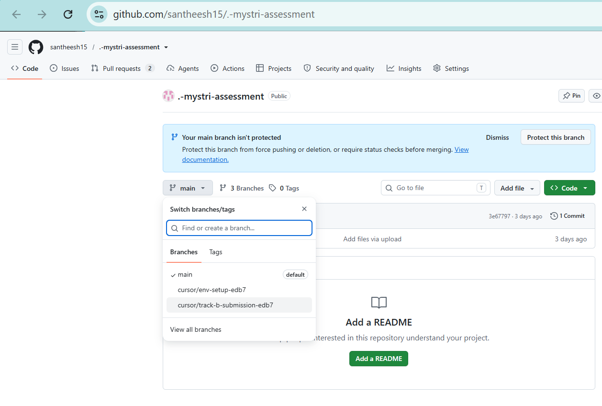

# Mystri assessment — Track B submission

This file is the **reviewer entry point** on branch **`cursor/track-b-submission-edb7`**. Follow the steps below **in order** to clone or download, run verification, and read the graded deliverables.

---

## Before you start (important)

| Item | Value |
| --- | --- |
| **Repository** | `https://github.com/santheesh15/.-mystri-assessment` |
| **Submission branch (use exactly)** | **`cursor/track-b-submission-edb7`** |
| **Graded code path** | **`Mystri-Applicant-Assessments/track-b/`** |
| **Applicant total time** | **3 hours 50 minutes (230 min)** — **`track-b/HANDOVER.md`** |
| **Python** | **3.10+** (stdlib only — no `pip install`) |
| **Internet** | Not required after you have the files |

**The submission is not on `main`.** If the branch dropdown shows **`main`**, or the tree has **`track-a/`** and no **`product1/`** folder under `track-b`, you are on the wrong branch.

---

## Step 1 — Switch branch on GitHub (`main` → submission)

1. Open `https://github.com/santheesh15/.-mystri-assessment` (repo is **public**; sign in only if you use a private fork).
2. Click the **branch** menu (left of the file list; default is **`main`**).
3. Select **`cursor/track-b-submission-edb7`** (not `main`, not `cursor/env-setup-edb7`).



4. Confirm:
   - URL contains **`/tree/cursor/track-b-submission-edb7/`**
   - You see **`Mystri-Applicant-Assessments/`** and this **`README.md`**
   - Under **`Mystri-Applicant-Assessments/track-b/`** you see **`experiment.py`** and **`product1/`**

Only then use **Clone**, **Download ZIP**, or browse files for grading.

**Note:** On **`main`** you may only see an empty tree or “Add a README” — that is normal. Graded files are on **`cursor/track-b-submission-edb7`** only.

---

## Step 2 — Get the project on your computer

### Option A — Git (recommended)

```powershell
git clone https://github.com/santheesh15/.-mystri-assessment.git
cd .-mystri-assessment
git checkout cursor/track-b-submission-edb7
```

**If you already cloned and stayed on `main`:**

```powershell
cd .-mystri-assessment
git fetch origin
git checkout cursor/track-b-submission-edb7
```

### Option B — ZIP

1. On GitHub, stay on branch **`cursor/track-b-submission-edb7`**.
2. **Code → Download ZIP** → extract the folder.

**`<REPO_ROOT>`** = the folder that **contains** **`Mystri-Applicant-Assessments`** (not your user home folder unless the repo lives there).

| How you got the code | Typical `<REPO_ROOT>` |
| --- | --- |
| `git clone` | `...\-.-mystri-assessment` |
| ZIP | `...\Downloads\<unzip-folder>` |

---

## Step 3 — Open the project folder (`track-b`)

You must run commands from **`Mystri-Applicant-Assessments/track-b`** (the folder that contains **`experiment.py`**).

**Windows (PowerShell or Command Prompt):**

```powershell
cd "<REPO_ROOT>\Mystri-Applicant-Assessments\track-b"
dir experiment.py
python --version
```

**macOS / Linux:**

```bash
cd "<REPO_ROOT>/Mystri-Applicant-Assessments/track-b"
ls experiment.py
python3 --version
```

If **`experiment.py`** is missing, fix **`<REPO_ROOT>`** or switch to branch **`cursor/track-b-submission-edb7`**.

---

## Step 4 — Run verification (required proof gate)

This runs the pipeline, checks outputs, and runs unit tests. It **writes** files under **`output/`**.

**Windows:**

```powershell
python product1\verify_product1.py
```

**macOS / Linux:**

```bash
python3 product1/verify_product1.py
```

**Success:** the last line includes **`PRODUCT 1 PASS`**.

**Do not edit** **`data/*.csv`** or **`data/scenario.json`** before grading — verify assumes the original Mystri pack.

---

## Step 5 — Inspect generated proof files

After **PASS**, open these (paths relative to **`track-b`**):

| File | What it shows |
| --- | --- |
| **`output/dicm_pipeline_trace.log`** | Step-by-step pipeline audit (START → dry-run → END) |
| **`output/integrated_report.json`** | Summary metrics (e.g. baseline **13** vs rules **5** proposals) |
| **`output/customer_structured_responses.json`** | Simulated customer receipt outcomes |

**Windows (Notepad):**

```powershell
notepad output\dicm_pipeline_trace.log
notepad output\customer_structured_responses.json
notepad output\integrated_report.json
```

**macOS:** `open output/dicm_pipeline_trace.log` (same for other files).  
**Linux:** use your editor, e.g. `xdg-open output/dicm_pipeline_trace.log`.

Trace timestamps use **UTC** and change each run — compare **structure and counts**, not byte-identical logs.

---

## Step 6 — Read the graded narrative (required)

Open in any Markdown viewer or text editor:

| File | Purpose |
| --- | --- |
| **`Mystri-Applicant-Assessments/track-b/DECISION.md`** | Business decision, calculations, recommendation |
| **`Mystri-Applicant-Assessments/track-b/HANDOVER.md`** | Applicant details, evidence table, reviewer steps |
| **`Mystri-Applicant-Assessments/track-b/SOURCES.md`** | External sources and limitations |

**Windows:**

```powershell
notepad DECISION.md
notepad HANDOVER.md
notepad SOURCES.md
```

**Deeper technical docs (optional):** `track-b/INTEGRATED_MODEL.md`, `track-b/docs/SETUP.md`, `track-b/docs/RULES_AND_LIMITATIONS.md`, `track-b/PROJECT_README.md`.

**Assignment PDF:** `Mystri-Applicant-Assessments/briefs/Track-B-Find-the-Worthwhile-Automation.pdf`.

---

## Step 7 — Optional extra checks

```powershell
# Windows — from track-b
python -m unittest discover -s tests -v
python experiment.py
```

```bash
# macOS / Linux — from track-b
python3 -m unittest discover -s tests -v
python3 experiment.py
```

Expect **38** tests passing. **`experiment.py`** prints the DICM collaboration summary and refreshes **`output/`**.

---

## Folder map (what matters for grading)

```
<REPO_ROOT>/
├── README.md                          ← you are here (reviewer guide)
└── Mystri-Applicant-Assessments/
    ├── README.md                      ← short index + same branch reminder
    ├── briefs/                        ← Track B PDF
    └── track-b/                       ← ALL runnable submission code
        ├── experiment.py              ← main demo entry
        ├── product1/verify_product1.py ← required verify gate
        ├── data/                      ← Mystri CSVs (do not modify for grading)
        ├── output/                    ← created by verify / experiment
        ├── DECISION.md, HANDOVER.md, SOURCES.md
        ├── tests/                     ← 38 unit tests
        └── docs/                      ← setup, rules, architecture
```

**Ignore for grading:** **`.cursor/`** (Cloud Agent environment only).

---

## Quick troubleshooting

| Problem | Likely fix |
| --- | --- |
| No **`product1/`** or **`track-a/`** visible | Wrong branch — use **`cursor/track-b-submission-edb7`** |
| **`cd Mystri-Applicant-Assessments\track-b`** fails | Use full path: **`cd "<REPO_ROOT>\Mystri-Applicant-Assessments\track-b"`** |
| **`python` not found** | Install Python 3.10+; on Mac/Linux use **`python3`** |
| Verify fails after editing **`data/`** | Restore original CSVs from the repo |
| **`UnicodeEncodeError`** on Windows | Use current branch (includes **`console_io.py`** fix) or see **`docs/SETUP.md`** |

Screenshot example (author Windows run): **`Mystri-Applicant-Assessments/track-b/docs/assets/verify-product1-pass-windows.png`**.

---

## One-page checklist

- [ ] GitHub branch = **`cursor/track-b-submission-edb7`**
- [ ] **`cd`** into **`.../Mystri-Applicant-Assessments/track-b`**
- [ ] **`python product1\verify_product1.py`** (or **`python3 product1/verify_product1.py`**) → **`PRODUCT 1 PASS`**
- [ ] Open **`output/`** three files + **`DECISION.md`** + **`HANDOVER.md`** + **`SOURCES.md`**
- [ ] Did **not** change **`track-b/data/`** before verify

**Future / out of scope for Product 1:** **`track-b/docs/FUTURE_SCOPE.md`**.
